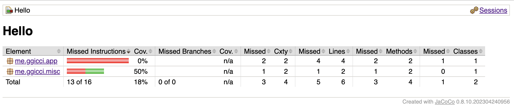
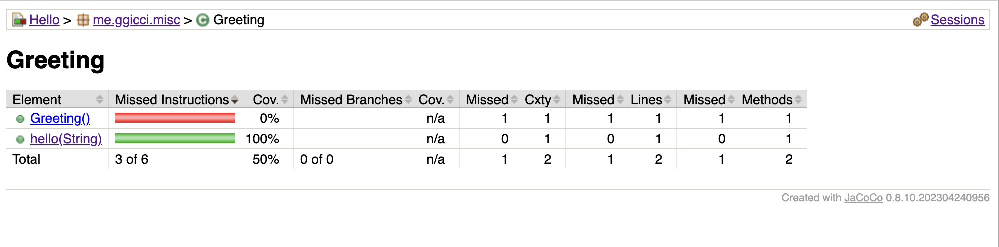
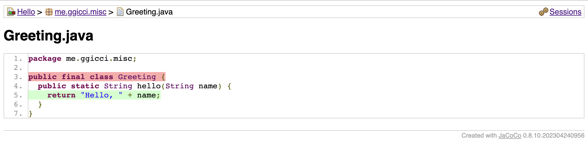

# Hello (Ant)

This project is using:

- [**Ant**](https://ant.apache.org/) as the build tool to build the project, config [build.xml](./build.xml)
- [**Ivy**](https://ant.apache.org/ivy/) as the dependency manager, dependencies are maintained in [ivy.xml](./ivy.xml)

## Used Commands

```bash
ant -p # list targets defined in build.xml

ant resolve # run ivy resolve task, i.e. download dependencies
ant retrieve # run ivy retrieve task, i.e. copy jars from ~/.ivy2/cache to lib/

ant compile # run compile task
ant test # run test task

ivy resolve # used in ant resolve
ivy retrieve # used in ant retrieve
```

## Unit Testing with Coverage Report

This project is using [JUnit4](https://junit.org/junit4/) to do unit testing and [JaCoCo](https://www.jacoco.org/jacoco/index.html) to generate the coverage report.

### `The prefix "jacoco" for element "jacoco:report" is not bound.`

Add `xmlns:jacoco="antlib:org.jacoco.ant"` to the `<project>` tag:

```xml
<project name="Hello" default="compile" basedir="." xmlns:jacoco="antlib:org.jacoco.ant" ...>
```

### `[taskdef] Could not load definitions from resource org/jacoco/ant/antlib.xml. It could not be found.`

Because it requires the `<taskdef>` tag to define the Ant Task for JaCoCo as the following:

```xml
<taskdef uri="antlib:org.jacoco.ant" resource="org/jacoco/ant/antlib.xml">
    <classpath path="${lib.dir}/jacocoant.jar" />
</taskdef>
```

We can find `jacocoant.jar` from the downloaded lib from https://www.jacoco.org/jacoco/index.html.

I downloaded version `0.8.10` and here's the jars in the lib folder:

```text
Downloads/jacoco-0.8.10/lib via ☕ v20.0.1
❯ md5sum *.jar
8331d56ccf06e829de437b72f1f25e1c  jacocoagent.jar
9625d46df1f69f791f177de04394e9c2  jacocoant.jar <---- we want this
3582529589a5cecfe565105d58a365a2  jacococli.jar
523c68f34e5b0cd8757c71018756364a  org.jacoco.agent-0.8.10.202304240956.jar
f20dd65a2d3a07fad4b56cccb7fc5dba  org.jacoco.ant-0.8.10.202304240956.jar    <---- but we got this
bdfb1217100e49d13f98a739b054e915  org.jacoco.core-0.8.10.202304240956.jar
a43e5a493c385429e1676118b76212a4  org.jacoco.report-0.8.10.202304240956.jar
```

While most of the online tutorial tells us to use artifact of `org.jacoco.ant` is all we need for ant, and the `ivy.xml` looks like this:

```xml
<dependency org="org.jacoco" name="org.jacoco.ant" rev="0.8.10" />
```

But after retriving the jars, we found that we didn't have a `jacocoant.jar`, see:

```text
~/.ivy2/cache
❯ find org.jacoco -type f -iname '*0.8.10.jar' | xargs md5sum
bdfb1217100e49d13f98a739b054e915  org.jacoco/org.jacoco.core/jars/org.jacoco.core-0.8.10.jar
a43e5a493c385429e1676118b76212a4  org.jacoco/org.jacoco.report/jars/org.jacoco.report-0.8.10.jar
2bcc6bf74d79b8f31ebcd4658b6a999f  org.jacoco/org.jacoco.cli/jars/org.jacoco.cli-0.8.10.jar
523c68f34e5b0cd8757c71018756364a  org.jacoco/org.jacoco.agent/jars/org.jacoco.agent-0.8.10.jar
f20dd65a2d3a07fad4b56cccb7fc5dba  org.jacoco/org.jacoco.ant/jars/org.jacoco.ant-0.8.10.jar  <---- see this
```

Find the answer here: https://stackoverflow.com/a/51102979/1592264

> On the page https://www.jacoco.org/jacoco/trunk/doc/repo.html we can find the following content:
> | Group ID | Artifact ID | Classifier | Description |
> | ---------- | -------------- | ---------- | ------------------------------------- |
> | org.jacoco | org.jacoco.ant | | Ant Tasks |
> | org.jacoco | org.jacoco.ant | nodeps | Ant Tasks (all dependencies included) |

And actually we need `org.jacoco.ant (nodeps)`, which is exactly the `jacocoant.jar`.

In the `ivy.xml`, add `e:classifier` to download `nodeps`. Don't forget to add the namespace `xmlns:e` to tag `<ivy-module>`. Reference: [ivy:install from maven with classifiers](https://stackoverflow.com/a/24946226/1592264).

```xml
<ivy-module version="2.0" xmlns:e="http://ant.apache.org/ivy/extra">

<dependency org="org.jacoco" name="org.jacoco.ant" rev="0.8.10">
    <artifact name="org.jacoco.ant" type="jar" e:classifier="nodeps" />
</dependency>
```

### `Class files must be compiled with debug information to link with source files.`

Run `javac` with debug information enabled. In `build.xml`, add property `debug=true` to tag `<javac>`. Reference: [Enabling javac debugging for Apache ANT](https://stackoverflow.com/a/11893054/1592264).

```xml
<javac srcdir="${src.dir}" destdir="${build.bin.dir}" includeantruntime="true" debug="true">
```

### Screenshots of the Coverage Report




